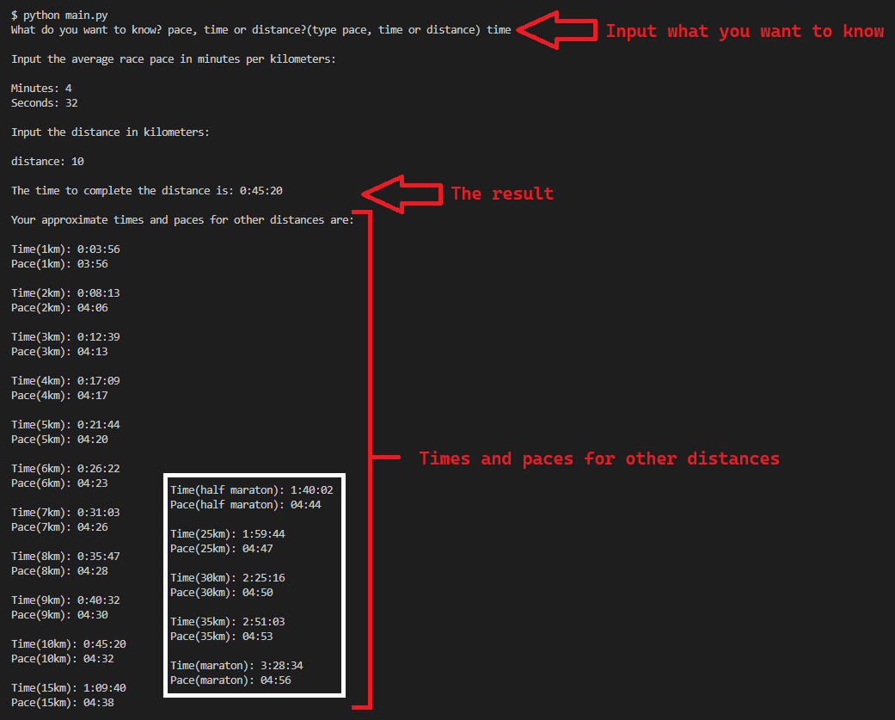

## Table of Contents
1. [General Info](#general-info)
2. [Technologies](#technology)
3. [Installation](#installation)
4. [Collaboration](#collaboration)
5. [Contact](#contact)
### General Info
***
In this application, which only works in console, you can calculate how long it took/would take to complete a given distance and pace, or what the average race pace would be, knowing how long it took/would take and the distance, or what is the distance, knowing the pace and the time it took/would take to complete it. In addition to this functionality, automatically calculates approximately the pace and times for different distances.



## Technology
***
A list of technologies used within the project:
* [Python](https://www.python.org/): Version 3.9.8
***
## Installation
***
A little intro about the installation. 

```
$ git clone https://github.com/Nelnico08/running-calculator.git
$ cd ../path/to/the/file/running-calculator
$ python main.py
Follow the instructions
```

## Collaboration
***
Hi! If you want to collaborate with the project you can make a fork and a pull request, I will take a look at it and if it's all okay I will merge it with the main branch. Thank you for your interest in the project! :smile:
## Contact
***
<p align="left"> <a href="https://github.com/Nelnico08" target="_blank" rel="noreferrer"></a> <a href="https://www.instagram.com/nelnico08/" target="_blank" rel="noreferrer"></a> <a href="https://www.linkedin.com/in/nnescurra/" target="_blank" rel="noreferrer"></a></p>
